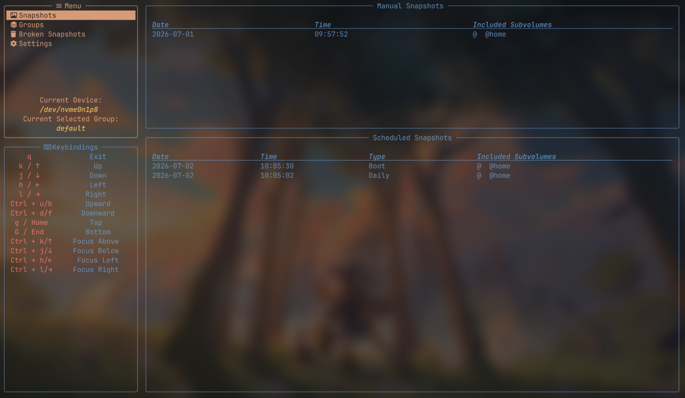
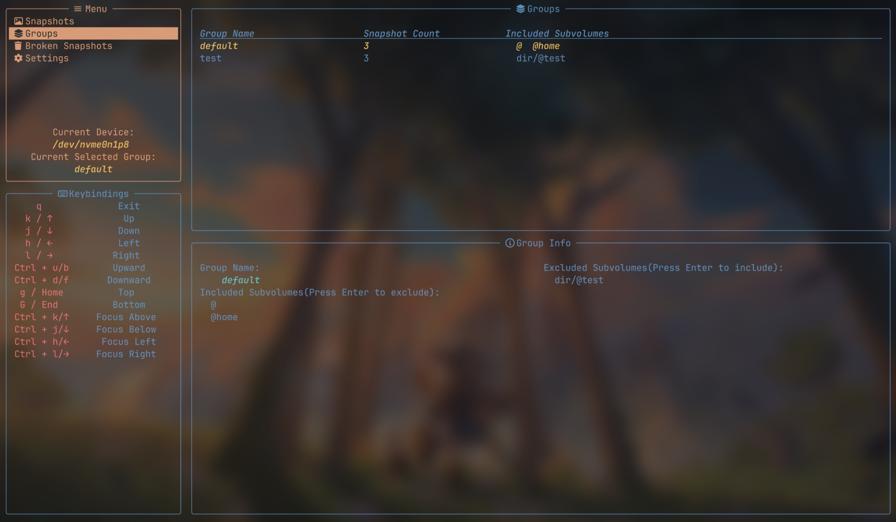

## Tram - 📸 A TUI Btrfs snapshot manager with scheduling support

1. [Screenshots](#screenshots)
2. [Features](#features)
3. [Setup](#setup)
4. [Quick Start](#quick-start)
5. [License](#license)

### Screenshots

<p align="center">
  
  
</p>

### Features

- 🖥️ **TUI** — A fast and keyboard-driven terminal interface.
- 📦 **Snapshot Groups** — Manage any combination of Btrfs subvolumes, including multiple Linux installations on the same filesystem.
- ⏰ **Scheduled Snapshots** — Automatically create snapshots at scheduled intervals.

### Setup

<details>
   <summary><b>Installation</b></summary>

- Arch Linux:
    ```bash
    yay -S tram_btrfs
    ```

</details>
<details>
    <summary><b>Boot Service</b></summary>

If you want the program to check snapshot schedule every time your system boots, enable the following **_Systemd_** service(This service simply execute `tram_btrfs --boot` during system startup. So if you're not using Systemd, configure your init system to run this command at boot instead.):

```bash
systemctl enable tram_btrfs.service
```

The program also checks the schedule whenever it starts. However, boot snapshots are only created when running with `--boot` flag.

</details>

### Quick Start

1. The program needs root privileges and stores its configuration under `~/.config/tram_btrfs/`. Therefore, it's recommended to run it with `sudo -E tram_btrfs` so that your `HOME` environment variables is preserved. Otherwise, the configuration file will be created under `/root/.config/`.

2. Snapshots are managed in groups. A snapshot group is a collection of subvolumes that are snapshotted together. You can create, rename, delete groups in "Groups" section. And if your Btrfs system contains "@" and "@home" subvolumes, it will automatically create a "default" group the first time you launch it.

3. The program can automatically create scheduled snapshots(daily, weekly, monthly and boot snapshots). In "Settings" section, you can set the maximum count of each type of scheduled snapshots. To enable the boot snapshots, see the [Setup](#setup) section above.

4. The keybindings are **Vim-like** and there's prompts below the menu as well.

5. By default, the program detects the Btrfs device containing the currently running Linux system and mounts it at `/run/tram_btrfs/`. But you can specify any Btrfs devices using `--device` flag.(`tram_btrfs --device '/dev/nvme0n1p8'` for example)

### License

Tram is licensed under the GNU General Public License v3.0 or later (GPL-3.0-or-later).

See the [LICENSE](./LICENSE) file for the full license text.
